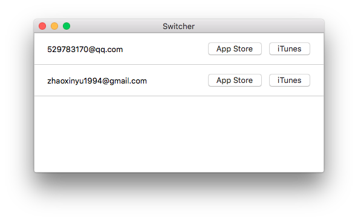

# Switcher

## [中文说明](#chinese)

Switcher is an OS X App which helps you easily switch Apple ID in App Store & iTunes App.

If you use just one Apple ID, this app may not be that useful for you. But if you use multiple IDs at the same time and thought switching between them hurt a lot, this may be the right app for you.

## Release
[Switcher v0.1](https://github.com/X140Yu/Switcher/releases/tag/v0.1)

## Useage
1. Enter `cmd + n` or press menu item `Account -> Add Account` to add an Apple ID.
2. Press `App Store` or `iTunes` button.
3. Enter the password for the Apple ID.
4. Press enter and wait patiently.

The first time you use, it will request you to add itself to the Accessibility, feel free to add it, it causes nothing.

PS. Right click a list item can choose to delete it.

## Is it safe?
The app saves your IDs in a local file and everytime you enter the password, for convience, it will save it in the memory(NOT in a local file). So feel free to use this app, it's totally safe. 

## Known issue
Certain states of App Store and iTunes App may cause the AppleScript part run to error, but don't worry, click login again, it will work.

# 中文说明
Switcher 是一个用 Swift 编写的 OS X 应用，可以很轻松地切换 App Store 和 iTunes 的账号，对于同时使用多个 Apple ID 的人来说非常地方便。

## 应用下载
[Switcher v0.1](https://github.com/X140Yu/Switcher/releases/tag/v0.1)

## 使用方法
1. 使用 `cmd + n` 快捷键或点击菜单栏的 `Account -> Add Account` 添加 Apple ID。
2. 点击条目上的 `App Store` 或 `iTunes` 按纽。
3. 在弹出的对话框中输入对应 ID 的密码。
4. 键入回车，然后耐心等待。

第一次使用本应用的时候会提示你把它加到 Accessibility 中，那是因为登录 App Store 或 iTunes 的时候使用了 AppleScript，放心加进去就好了。

PS. 右键点击一个条目可以将它删掉。

## 安全吗？
为了使用的方便，应用会在本地储存已经添加的 Apple ID，而且会把密码储存在内存当中。本应用不会以任何方式储存用户的密码，请放心使用。

## 已知问题
App Store 和 iTunes 应用的某些状态会导致 AppleScript 部分代码运行出错，不过再登录一次，问题就可以解决。

